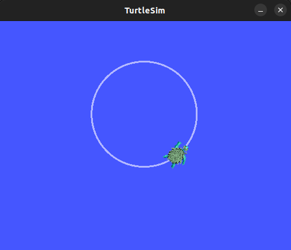
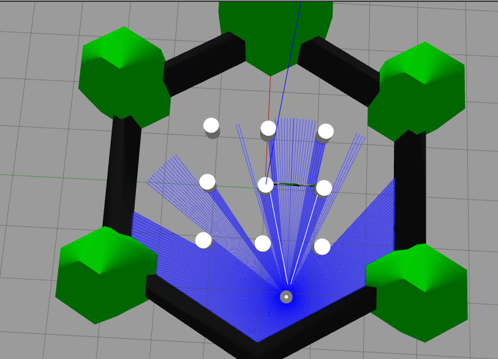
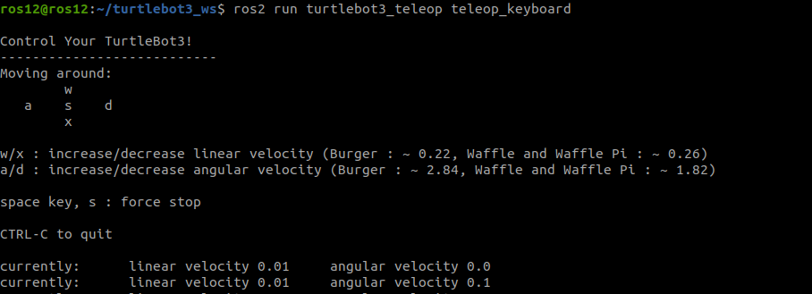
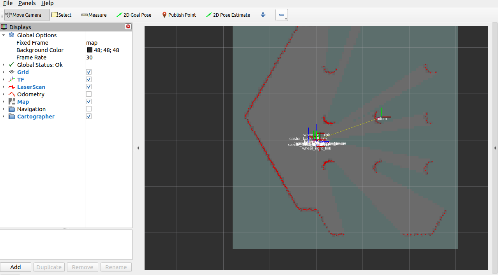
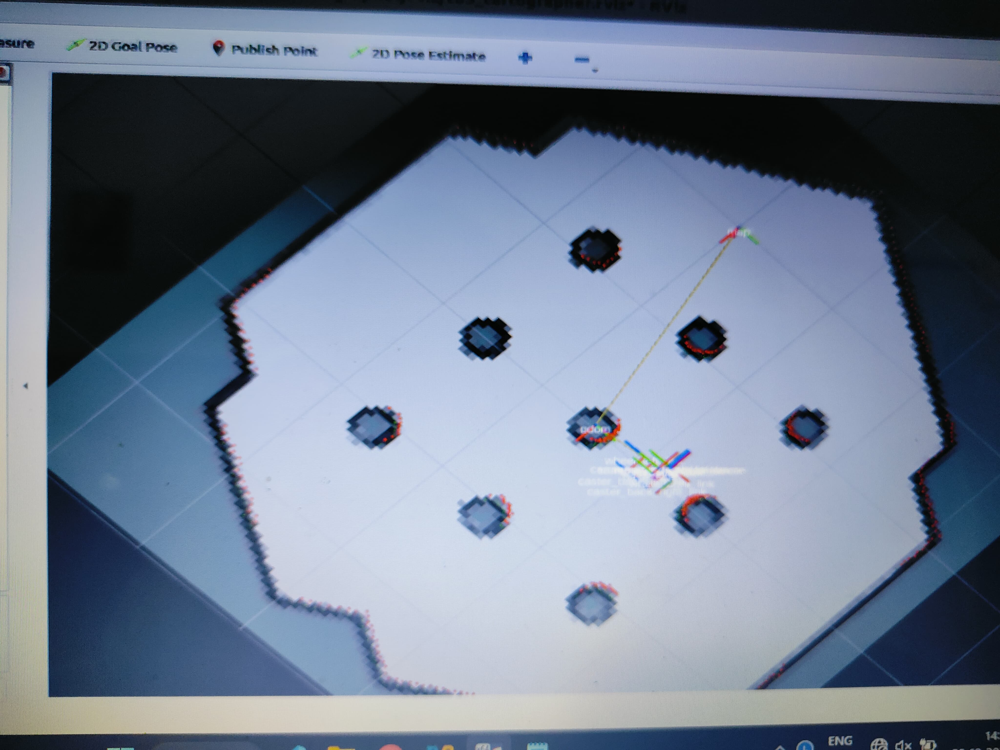

# Robotics Simulation with ROS2 and TurtleBot
This comprehensive README outlines the key tasks and learnings from the workshop on leveraging ROS2 for robotics simulation and control, specifically with the TurtleBot in a Gazebo environment.

## Workshop Goals
* Master and apply basic Linux terminal commands.
* Gain in-depth familiarity with ROS2 fundamentals, including installation, setup, and commands.
* Design and integrate a ROS2 package with Python scripts.
* Launch and control a TurtleBot in simulation using VS Code, Gazebo, and RViz.
* Simulate bot movement and map the environment for autonomous navigation.

## Workshop Steps
 1. Basic Linux Terminal Commands
    * Objective: Achieve proficiency in fundamental Linux commands.
    * Commands Covered:
        - Navigation: ```ls```, ```cd```, ```pwd```.
        - File operations: ```mkdir```, ```touch```, ```rm```, ```cp```, ```mv```.
        - Permissions: ```chmod```, ```chown```.
    * Outcome: Developed efficient navigation and file handling skills in the Linux terminal, crucial for ROS2 package management.
  
2. Introduction to ROS2
    * Objective: Understand the intricacies of ROS2 (Robot Operating System 2).
    * Topics Covered:
      - ROS2 architecture and components.
      - Basic ROS2 commands: ```ros2 topic```, ```ros2 node```, ```ros2 service```.
    * Outcome: Acquired a solid foundation in ROS2, a middleware for robotic applications.

3. Creating the First ROS2 Package
    * Objective: Set up a new ROS2 package and integrate Python scripts.
    * Steps:
      - Created a ROS2 package using colcon build tool.
      - Added Python scripts within the package for robot control and simulation tasks.
    * Outcome: Successfully built and executed a custom ROS2 package.
 
4. Drawing a Circle with TurtleBot in VS Code
    * Objective: Use VS Code to launch TurtleBot and draw a circle in simulation.
    * Steps:
      - Configured VS Code for ROS2 development.
      - Launched the TurtleBot simulation and executed commands to make the bot trace a circular path.
    * Outcome: Acquired hands-on experience in bot control and ROS2 integration with VS Code.
 
<p align="center"> 

5. Launching Gazebo with ```TurtleBot Waffle``` and Obstacles
    * Objective: Simulate a TurtleBot Waffle in Gazebo with obstacles.
    * Steps:
      - Selected the ```TurtleBot Waffle``` model.
      - Launched a Gazebo environment with pre-defined obstacles for navigation challenges.
    * Outcome: Gained familiarity with Gazebo simulation environment and TurtleBot models.
<p align="center"> 

6. Bot Control with ```teleop_key```
    * Objective: Manually control the TurtleBot using keyboard commands.
    * Steps:
      - Used ```teleop_key``` command to navigate the bot within the Gazebo environment.
      - Simulated obstacle avoidance and navigation in real-time.
    * Outcome: Learned the basics of teleoperation and manual control for robots.
<p align="center"> 
 
7. Mapping the Area with RViz for Automatic Simulation
    * Objective: Map the Gazebo environment using RViz for autonomous bot navigation.
    * Steps:
       - Launched RViz alongside Gazebo to visualize and map the simulated area.
       - Used the map for autonomous pathfinding and area coverage by the TurtleBot.
    * Outcome: Successfully mapped the environment and set up the TurtleBot for automatic navigation in simulation.
<p align="center"> 
<p align="center"> 
https://github.com/user-attachments/assets/4c9c8551-60e3-41cf-ab1f-3ee110c9f509


## Summary of Learnings
This workshop provided extensive practical experience in robotics simulation using ROS2, Gazebo, and RViz, enabling a deeper understanding of robot control, mapping, and simulation environments. By the end, participants were able to:

* Navigate and use Linux commands for ROS2 tasks with ease.
* Create and manage ROS2 packages with Python integration efficiently.
* Simulate, control, and map environments with TurtleBot in Gazebo and RViz effectively.
